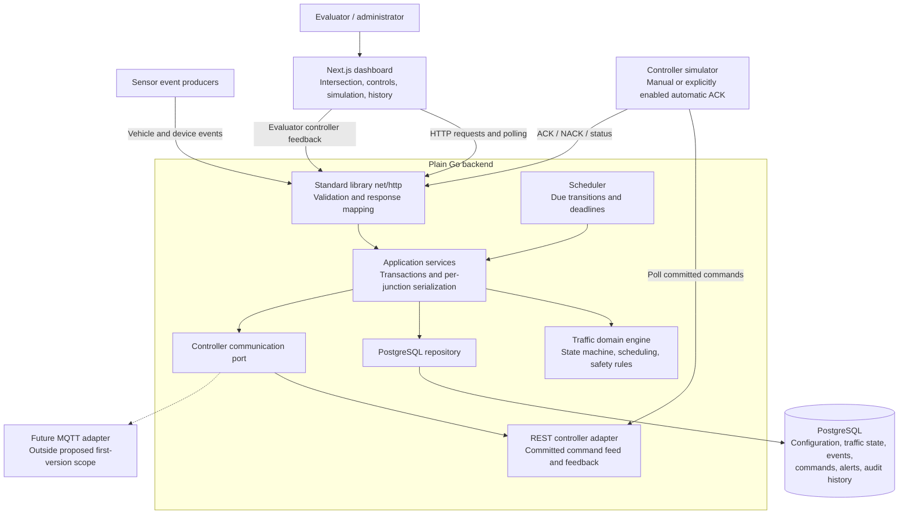
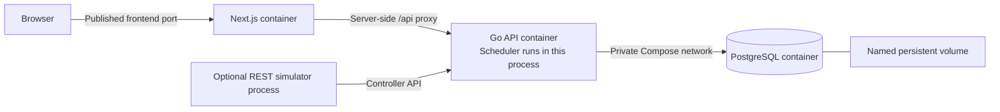
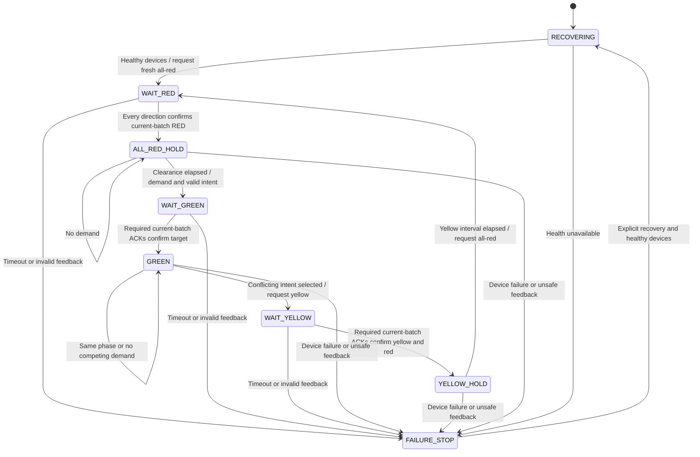

# Factory Traffic Management System — Architecture

## Component architecture



The domain engine receives typed junction state, validated events or intents, and an explicit time. It returns the next state plus effects: controller requests, audit entries, and alerts. It does not open transactions, execute SQL, send HTTP requests, sleep, or import Next.js/MQTT code.

Application services load state under the junction lock, call the engine, validate its result, persist its effects, and commit. The repository owns SQL and database constraints. The HTTP layer owns decoding, request-size limits, routing, and mapping typed errors to HTTP responses. A PostgreSQL driver is an infrastructure dependency; no Go web framework is needed.

The REST adapter exposes a durable feed of committed controller commands. It does not convert command publication into an acknowledgement. A later MQTT dispatcher can publish those same persisted commands and feed controller feedback through the same application services.

## Docker runtime



The topology uses one backend process and one scheduler, a Next.js application, and PostgreSQL on a private Compose network. The frontend proxies `/api` to the backend so browser code can use same-origin requests. Docker service names are resolved by server-side code, not by the user's browser. PostgreSQL has a health check; migrations finish before the API accepts traffic; the API reports database readiness; frontend startup does not imply the API is ready. Stopping containers retains the database volume.

Single-backend deployment is a first-version limit, enforced by a session-level PostgreSQL advisory ownership lock. Row locks protect concurrent requests and scheduler ticks. Multi-instance deployment would require leader election and distributed controller ownership before it is supported.

## Junction aggregate and consistency

One junction is the consistency boundary. Its aggregate includes configuration, runtime state, directional signal evidence, devices, vehicle queue entries, active override, and relevant command batches. Every sensor event, manual command, controller feedback item, device event, recovery action, and scheduler tick follows the same write path:

1. Start a PostgreSQL transaction and lock the junction row with `SELECT ... FOR UPDATE`.
2. Read the current aggregate. Validate identity, ordering, device health, and command correlation.
3. Apply the domain operation using a supplied time and current configuration.
4. Assert signal and state-machine invariants.
5. Persist changes, idempotency result, command effects, alerts, and audit entries atomically.
6. Commit before returning success or exposing controller commands.

Different junctions can progress concurrently. Requests affecting the same junction are serialized. There is no controller network call while holding the database lock. Reads of status use a consistent transaction snapshot so queues, mode, desired state, and actual state describe the same committed revision.

Expected business rejections, such as a stale vehicle event, can be recorded and committed as audit outcomes without changing the queue. SQL/infrastructure errors roll back the operation. Duplicate and conflict handling must not abort the transaction before the audit can be written: use conflict-aware inserts and inspect the previously persisted event.

The globally unique sensor event ID is enforced by a primary key, including submissions claiming different junctions. Compare canonical validated fields, not raw JSON formatting. Sequence high-water marks belong to a vehicle within its junction/direction stream; a direction-wide high-water rejection would incorrectly discard reordered events for different vehicles. Server acceptance under the junction lock defines serialized control order and waiting timers. Device timestamp is retained separately from server acceptance time; the first version records server receipt at the transactional acceptance boundary rather than persisting an extra ingress-clock field.

## Operating mode, stage, and evidence

Mode and stage answer different questions:

- **Effective mode:** why the junction is being controlled: AUTOMATIC, MANUAL, EMERGENCY, or FAILURE.
- **Stage:** where the signal transition is: recovery, awaiting feedback, timed hold, steady green, or failure stop.
- **Desired signal:** the backend's requested RED, YELLOW, or GREEN for each direction.
- **Actual signal:** latest trusted controller-confirmed RED, YELLOW, GREEN, or UNKNOWN, with evidence timestamp and command correlation.

Mode precedence is FAILURE, then EMERGENCY, then unexpired MANUAL, then AUTOMATIC. A manual request can remain stored while an emergency temporarily takes precedence. Store stage deadlines independently from manual and emergency expiry deadlines. Physical UNKNOWN is an internal evidence value, not a fourth lamp color to command.

Never collapse these values into one `signal_state`, and never calculate physical confirmations from desired state.

## Safe transition state machine



| Stage | Desired signals | Requirement to advance |
| --- | --- | --- |
| RECOVERING | All-red intent; actual evidence invalidated | Healthy communication and a fresh recovery batch |
| WAIT_RED | All directions RED | All four correlated red confirmations |
| ALL_RED_HOLD | All directions RED | Confirmed clearance interval elapsed and eligible intent exists |
| WAIT_GREEN | Target phase GREEN; others RED | Complete matching feedback for this batch |
| GREEN | Current phase GREEN; others RED | Selection rules authorize change; emergency can preempt normal duration |
| WAIT_YELLOW | Outgoing phase YELLOW; others RED | Complete matching feedback for this batch |
| YELLOW_HOLD | Outgoing phase YELLOW; others RED | Confirmed yellow interval elapsed |
| FAILURE_STOP | All-red requested when communication permits | No green grants; explicit health/recovery workflow |

The next phase is chosen again after all-red clearance, so a newer emergency or manual intent does not reuse an obsolete target. A new intent never cancels a yellow hold or shortens the clearance interval. Same-phase manual or emergency requests change intent/mode without forcing an unnecessary lamp cycle.

Commands are independent per-direction physical operations grouped into one transition batch. Some lamps can execute before all ACKs arrive. An emergency arriving during WAIT_GREEN therefore treats the requested phase as potentially physically green: after completing its confirmations, start yellow immediately; on timeout, enter failure. Do not overwrite a potentially executing green batch with a conflicting green request.

Only commands for a compatible phase can request green. A preceding all-red batch must be fully confirmed before any new green batch is exposed to a controller. The green timer starts after the complete green batch is confirmed; the yellow timer starts after the complete yellow batch is confirmed. Waiting for feedback is not counted as a timed hold.

Failure handling can request all-red immediately as a stop action rather than continue normal phase service. This is a configured exception to normal yellow sequencing, not a transition to another green. The REST simulator implements this stop behavior. Real hardware's mandatory yellow and local watchdog behavior require a hardware-specific agreement before integration.

## Controller contract and physical limits

Every command carries `command_id`, `batch_id`, `junction_id`, direction, requested state, monotonically increasing junction generation, issue time, and expiry. Each batch has one immutable target signal map. Exactly one current batch can authorize progress.

Feedback must reference an existing command and its junction. Direction is derived from that command; an optional supplied direction must agree. ACK status is not sufficient by itself: the reported actual state must match the requested state. Validate feedback timestamps, but use server time for ACK deadlines. Timestamp alone never proves ordering.

- Partial ACKs update the corresponding actual evidence but do not complete a batch.
- Identical repeated ACKs return the previously accepted result without advancing twice.
- A different state reported for an already acknowledged command is a fault report, not an idempotent replay.
- Late/superseded ACKs are retained in audit and cannot satisfy a current batch. A credible conflicting physical report invalidates evidence and enters failure.
- Expired commands cannot authorize a transition. Recovery supersedes old pending work and creates a newer all-red generation.
- No automatic command retry is proposed initially. A persistent fault must not create a new all-red batch every scheduler tick; one stop batch is issued per failure/recovery episode, with explicit later recovery attempts.

**Required physical-adapter guarantee:** a controller applies generation fencing, rejects expired/older commands, retains its fence across reconnection, and enforces the two-phase conflict interlock. The simulator must exercise this behavior rather than ACK anything blindly. Without fencing, an old delayed GREEN could execute after a newer RED ACK; backend row locks and ACK checks cannot prevent that physical hazard. The PDF does not define this hardware protocol, so it must be confirmed or documented as a limitation before real hardware use.

Fresh all-red confirmation means observations of physical lamps after old work has been fenced, not merely confirmation that a message was received. An offline controller cannot be made physically safe by database writes. The API must show unverified states as UNKNOWN and the UI must show failure.

ONLINE status is not a lamp-state ACK. Initial controller, sensor, and signal health is UNKNOWN until the simulator or device reports health; restart invalidates both signal evidence and device health. Device reports are ordered by server acceptance in the REST simulation. There is one junction-wide SIGNAL_CONTROLLER; its optional direction field is accepted for PDF compatibility but does not scope the controller. Sensors and signals have direction-specific health. Real hardware will require device identifiers, session/sequence ordering, and heartbeat expiry; no heartbeat interval is specified in the requirements.

## Scheduling and timers

The user confirmed the documented operating policies and the remaining simulator/fault choices before implementation. Configurable policy values belong in junction configuration and policy types, not HTTP handlers or frontend logic.

| Policy | Configured value |
| --- | --- |
| Normal green / yellow / all-red clearance | 30 / 5 / 2 seconds, measured after complete confirmation |
| ACK deadline | 5 seconds; no automatic retries |
| Manual expiry / emergency priority expiry | 120 / 120 seconds |
| Starvation threshold / scheduling age divisor | 120 / 10 seconds |
| Normal vehicle weights | TRUCK 3, FORKLIFT 2, EMPLOYEE_VEHICLE 1; expired EMERGENCY uses weight 3 |
| Mode priority | Failure, emergency, unexpired manual, automatic |
| Competing emergencies | Earliest server acceptance, then arrival event ID |
| Manual replacement | Last serialized accepted request replaces prior manual intent |
| Offline sensor or signal | Stop new green grants and require explicit recovery after health returns |
| Vehicle location | One queued direction per vehicle per junction |
| Controller simulation | Standalone REST simulator with generation fencing and explicit enablement |

At a safe selection point, first apply health/failure gating, then eligible emergencies, then manual intent, then automatic scheduling. Automatic scheduling sums vehicle weights plus waiting seconds divided by 10 per vehicle. Tie-break: keep the current eligible phase, then choose the phase with the oldest accepted arrival, then stable phase ID. Emergency-expired vehicles remain in the queue but lose emergency priority and use truck weight.

Starvation protection uses time since the later of vehicle acceptance and the phase's most recent confirmed service, persisted in `last_served`. A currently confirmed GREEN phase is being served now; its latest service time is persisted when it starts yellow so all-red reselection cannot restore an old queue ahead of overdue conflicting traffic. This refinement prevents a continuously served but uncleared queue from monopolizing oldest-waiting priority. A phase with at least 120 seconds of unserved demand takes precedence at the next safe automatic selection point. Vehicle queue waiting time itself is still measured from acceptance and is not reset by service. Configuration validation requires expired emergency weight to match truck weight.

Age is measured from server acceptance of an arrival, not device clock time. Signal timing does not remove vehicles. Manual control and continuing emergencies can delay ordinary traffic indefinitely; the normal starvation threshold is not an unconditional maximum-wait guarantee. Oldest-first emergency service also relies on clearance or expiry to allow a competing emergency through.

A 250 ms scheduler cadence calls the same transaction path with a time input. Persist absolute deadlines; a tick that runs late extends a safe hold rather than abbreviating it. Use UTC timestamps and an injected clock in domain tests. Domain time must not move backwards relative to the previous evaluated time. Timing after a process restart is recovered through all-red rather than blindly reusing the pre-restart signal deadline.

There is no `sleep` in an HTTP handler and no long-lived database transaction waiting for a lamp timer.

## Emergency preemption example

Assume NORTH/SOUTH is confirmed GREEN and an EAST emergency arrives. The following example uses the proposed durations; each arrow represents a short operation, not an open transaction lasting through the interval.

```mermaid
sequenceDiagram
    participant Sensor
    participant API as Go API
    participant App as Application + domain
    participant DB as PostgreSQL
    participant Controller
    participant Scheduler
    Sensor->>API: EAST emergency arrival
    API->>App: Validated event
    App->>DB: Lock A; deduplicate; persist queue and emergency
    App->>DB: Persist WAIT_YELLOW and yellow batch; commit
    App-->>API: Event accepted; physical transition pending
    API-->>Sensor: Accepted result
    Controller->>API: Poll committed controller commands
    API-->>Controller: NORTH/SOUTH YELLOW; EAST/WEST RED
    Controller->>API: Correlated ACKs for batch
    API->>App: Process each feedback transaction
    App->>DB: Last ACK starts YELLOW_HOLD deadline; commit
    Scheduler->>App: Tick after confirmed 5-second hold
    App->>DB: Lock A; persist WAIT_RED and all-red batch; commit
    Controller->>API: Poll and confirm fresh all-red batch
    API->>App: Process red ACKs
    App->>DB: Last ACK starts ALL_RED_HOLD deadline; commit
    Scheduler->>App: Tick after confirmed 2-second clearance
    App->>DB: Lock A; reselect intent; persist WAIT_GREEN batch; commit
    Controller->>API: Poll and ACK EAST/WEST GREEN; NORTH/SOUTH RED
    API->>App: Process green ACKs
    App->>DB: Persist GREEN with EMERGENCY mode; commit
```

Each intermediate status remains observable on the dashboard. A timeout or device fault at any step takes the failure path. The EAST emergency remains queued until clearance; a GREEN ACK does not clear it. Duplicate arrival submission returns the original outcome without adding another emergency or creating another transition batch.

## Persistence and ERD

Persist normalized vehicle/event/command history rather than only a JSON state blob. Queue counts are derived from active queue entries. Tombstones retain event ordering after clearance. Runtime and signal evidence are persisted alongside the history that explains their changes.

```mermaid
erDiagram
    JUNCTIONS ||--|| JUNCTION_RUNTIME : has
    JUNCTIONS ||--|{ PHASES : configures
    JUNCTIONS ||--|{ DIRECTIONS : configures
    PHASES ||--|{ PHASE_MEMBERS : contains
    DIRECTIONS ||--|| PHASE_MEMBERS : belongs_to
    DIRECTIONS ||--|| SIGNAL_STATES : has
    JUNCTIONS ||--|{ DEVICES : monitors
    DIRECTIONS ||--o{ VEHICLE_TRACKERS : scopes
    VEHICLE_TRACKERS ||--o| QUEUE_ENTRIES : currently_waits
    JUNCTIONS o|--o{ SENSOR_EVENTS : receives
    JUNCTIONS ||--o{ CONTROL_INTENTS : records
    JUNCTIONS ||--o{ COMMAND_BATCHES : issues
    COMMAND_BATCHES ||--|{ CONTROLLER_COMMANDS : contains
    DIRECTIONS ||--o{ CONTROLLER_COMMANDS : addresses
    JUNCTIONS o|--o{ CONTROLLER_FEEDBACK : receives
    CONTROLLER_COMMANDS o|--o{ CONTROLLER_FEEDBACK : correlates
    JUNCTIONS o|--o{ DEVICE_EVENTS : receives
    JUNCTIONS ||--o{ ALERTS : raises
    JUNCTIONS o|--o{ AUDIT_LOG : explains

    JUNCTIONS {
        text id PK
        text name
        jsonb policy_config
        timestamptz created_at
    }
    JUNCTION_RUNTIME {
        text junction_id PK,FK
        text effective_mode
        text stage
        text current_phase_id FK
        text target_phase_id FK
        bigint generation
        bigint revision
        uuid active_batch_id FK
        uuid active_manual_intent_id FK
        timestamptz stage_deadline
        timestamptz last_evaluated_at
        jsonb last_served
        text fault
        boolean recovery_required
        timestamptz updated_at
    }
    PHASES {
        text junction_id PK,FK
        text phase_id PK
    }
    DIRECTIONS {
        text junction_id PK,FK
        text direction PK
    }
    PHASE_MEMBERS {
        text junction_id PK,FK
        text phase_id PK,FK
        text direction PK,FK
    }
    SIGNAL_STATES {
        text junction_id PK,FK
        text direction PK,FK
        text desired_state
        text actual_state
        uuid confirmed_command_id FK
        timestamptz confirmed_at
    }
    DEVICES {
        text junction_id PK,FK
        text device_key PK
        text device_type
        text direction
        text status
        timestamptz last_reported_at
    }
    VEHICLE_TRACKERS {
        text junction_id PK,FK
        text direction PK,FK
        text vehicle_id PK
        bigint last_sequence_no
        text last_event_id FK
        text last_event_type
    }
    QUEUE_ENTRIES {
        text junction_id PK,FK
        text direction PK,FK
        text vehicle_id PK,FK
        text vehicle_type
        text arrival_event_id FK
        timestamptz accepted_at
        timestamptz emergency_expires_at
        boolean emergency_priority_active
    }
    SENSOR_EVENTS {
        text event_id PK
        text junction_id FK
        text claimed_junction_id
        text direction
        text vehicle_id
        text event_type
        bigint sequence_no
        text payload_hash
        jsonb canonical_payload
        text outcome
        jsonb result
        timestamptz sensor_at
        timestamptz received_at
        timestamptz accepted_at
    }
    CONTROL_INTENTS {
        uuid id PK
        text junction_id FK
        text command
        text requested_direction
        text target_phase_id FK
        text status
        timestamptz accepted_at
        timestamptz expires_at
    }
    COMMAND_BATCHES {
        uuid id PK
        text junction_id FK
        bigint generation
        text purpose
        text target_phase_id FK
        jsonb target_signals
        text status
        timestamptz issued_at
        timestamptz deadline_at
        timestamptz completed_at
    }
    CONTROLLER_COMMANDS {
        uuid id PK
        uuid batch_id FK
        text junction_id FK
        text direction FK
        text requested_state
        text status
        timestamptz acknowledged_at
    }
    CONTROLLER_FEEDBACK {
        bigint id PK
        uuid command_id FK
        text claimed_command_id
        text junction_id FK
        text claimed_junction_id
        text status
        text actual_state
        text outcome
        jsonb payload
        timestamptz controller_at
        timestamptz received_at
    }
    DEVICE_EVENTS {
        text event_id PK
        text junction_id FK
        text claimed_junction_id
        text device_key
        text payload_hash
        jsonb payload
        text outcome
        jsonb result
        timestamptz device_at
        timestamptz received_at
    }
    ALERTS {
        text junction_id PK,FK
        text code PK
        text severity
        text message
        timestamptz opened_at PK
        timestamptz resolved_at
    }
    AUDIT_LOG {
        bigint id PK
        text junction_id FK
        bigint junction_revision
        text event_type
        text direction
        text sensor_event_id
        uuid command_id FK
        uuid intent_id FK
        jsonb details
        timestamptz occurred_at
    }
```



This ERD uses several composite foreign keys. A `phase_id` is unique only within its junction; a direction is keyed by `(junction_id, direction)`; a queue entry references the full tracker key `(junction_id, direction, vehicle_id)`. Command/batch and runtime references must also constrain the junction, not just the UUID. The diagram shows logical cardinality; these integrity rules must appear in the migration.

Schema constraints and indexes:

- Nonempty identifiers, valid enum-like values, positive sequence numbers, and validated positive policy durations.
- Exactly one phase membership per direction for this two-phase model; no duplicated or unconfigured directions.
- Unique phase membership, `(batch_id, direction)`, `(junction_id, generation)`, and one pending current batch per junction.
- No negative queue count column: queue counts are `COUNT` results over queue entries.
- At most one active queue entry per `(junction_id, vehicle_id)` across directions. A cross-direction movement requires clearance before arrival elsewhere.
- An active manual intent is identified by runtime state; replaced/expired intents remain as history.
- Index active queue entries by junction, direction, and acceptance time; batches by status/deadline; commands by batch; audit by `(junction_id, id)`; active alerts by junction/code.
- UTC `timestamptz` fields; NULL actual confirmation when evidence is UNKNOWN.
- Unknown-junction events and invalid payloads are recorded in rejection audit entries with the claimed junction retained in details. The event ledgers reserve structurally valid events for existing junctions; malformed JSON gets a request-level rejection audit without queue mutation. Payloads are size-bounded.
- Device event IDs use their own namespace in this design; sensor event IDs are globally unique within sensor events. Feedback has append-only receipt IDs because the source format has no feedback event ID.
- Do not delete tombstones, deduplication records, or audit history in the first version. A later retention policy needs a defined event replay horizon.

Cross-row traffic safety is enforced by the serialized domain operation and its invariant checker; CHECK constraints alone cannot prove that physical conflicting lamps are not green.

## Restart and failure recovery

1. Acquire exclusive controller ownership for the supported single-process deployment before serving traffic operations.
2. Apply schema migrations, load configuration, and lock each persisted junction.
3. Preserve vehicles, deduplication records, accepted intents, alerts, and history. Re-evaluate absolute manual/emergency expiries against current time.
4. Supersede pending batches, advance the command generation, mark physical evidence UNKNOWN, clear old stage deadlines, and record a recovery audit entry.
5. Establish controller health and fencing. Publish a fresh all-red recovery batch when possible.
6. Collect fresh all-red feedback for every direction and complete the clearance interval.
7. Resume the highest eligible intent through the state machine. Remain in failure if physical state cannot be established.

PostgreSQL unavailability stops traffic mutation and command publication. Without the database, no new control intent is accepted and no persisted command can be confirmed; API readiness fails. Existing hardware behavior depends on its local watchdog/interlock contract. Reopening a database connection does not prove physical state: run reconciliation if control continuity was lost. Local hardware watchdog duration remains a question.

## API responsibilities

The required endpoints are retained. Additional paths below are design proposals and will be finalized in API documentation.

| Endpoint | Responsibility |
| --- | --- |
| `GET /api/junctions` | List configured junctions with concise status |
| `GET /api/junctions/{id}` | Configuration and policy values |
| `POST /api/junctions` | Validate and create configuration, initially unreconciled/all-red intent |
| `GET /api/junctions/{id}/status` | One snapshot: revision, mode, stage, phase, device health, desired/actual signals, queues, emergencies, alerts, deadlines, pending commands |
| `POST /api/sensor-events` | Arrival/clearance validation, deduplication, ordering, queue change, scheduling effects |
| `POST /api/junctions/{id}/commands` | Manual request and return to automatic; optionally explicit recovery intent |
| `GET /api/junctions/{id}/controller-commands` | Committed command feed including current batch and deadlines |
| `POST /api/controller-events` | Correlated ACK/NACK/physical report processing |
| `POST /api/device-events` | Controller, sensor, and signal health events with event IDs |
| `GET /api/junctions/{id}/history` | Bounded cursor pagination over immutable audit entries |
| `GET /health/live` and `GET /health/ready` | Process liveness and database/recovery readiness information |

Proposed responses: 201 for created configuration/newly recorded events; 200 for a replay or completed read; 202 for an accepted asynchronous control/recovery intent; 400 for malformed requests; 404 for unknown junction; 409 for conflicting reuse or stale state/ordering; 422 for a well-formed unsupported operation; 503 for unavailable persistence. Distinguish `accepted`, `duplicate`, `rejected`, and `pending_physical_confirmation` in response bodies. Fault feedback can be recorded successfully while making the junction fail; it is not necessarily an HTTP validation error.

Manual request IDs and a request retry policy are not defined by the PDF. The proposed first version treats a new manual submission as a new intent; the UI must not automatically retry it. A future optional idempotency key can make control requests safely retryable.

## Frontend behavior

The Next.js dashboard renders backend snapshots. It does not run the traffic state machine, estimate queue counts from clicks, or optimistically turn lights green.

Overview and detail use the same status contract. Show desired and actual lamps separately, UNKNOWN evidence, active mode and transition stage, current/emergency directions, controller/sensor health, deadlines, pending command IDs, and alerts. A desired/actual mismatch while awaiting feedback is “pending confirmation”; after timeout or inconsistent feedback it is a fault. A normal pending change should not be styled as successful execution.

Arrival/clearance forms generate unique event IDs and show the payload/result. Provide an explicit replay action for duplicate demonstrations. Maintain simulator sequence counters from backend tracker/event data rather than resetting a browser-only counter after reload. Command acknowledgement controls reference persisted pending commands. Controller/sensor/signal health controls submit device events. A new vehicle arrival does not imply it has crossed the junction.

Polling is proposed at one-second intervals, with cancellation, no overlapping fetches, and revision checks against out-of-order responses. On errors, retain the last successful snapshot with a visible stale-data marker, surface the failed operation, and back off repeated fetch failures. Do not render missing actual signals as RED. Traffic continues on the backend independently of browser connectivity.

The automatic simulator is a standalone Node.js process, explicitly enabled through a Docker Compose profile or its script. It runs independently of the dashboard, validates generation/expiry, persists fencing and simulated physical lamps to a separate file/volume, and submits feedback through public APIs. Manual ACK mode is available when that process is stopped, allowing partial confirmation, timeout, and reconnection demonstrations. The simulator announces UNKNOWN device health after backend startup, but does not override explicit OFFLINE reports.

## Planned source boundaries

```text
backend/
  cmd/server/                    startup, dependency wiring, shutdown
  internal/domain/               aggregate, policies, events, state machine, invariants
  internal/application/          transactional use cases and scheduler
  internal/ports/                repository and controller interfaces
  internal/adapters/http/        standard-library routes and JSON DTOs
  internal/adapters/postgres/    repositories and transaction implementation
  internal/adapters/controller/  REST command feed / simulator integration
  migrations/                   versioned PostgreSQL schema
frontend/
  app/                          Next.js overview, detail, API proxy
  components/                   lamps, intersection, controls, activity
  lib/                          typed API client and polling
tools/                          standalone controller simulation and scenarios
docs/                           API reference and demonstration instructions
compose.yaml
README.md
ARCHITECTURE.md
```

These are planned module responsibilities, not generated directories. Keep dependencies pointed inward: adapters depend on application/ports/domain; domain depends only on Go's standard library and its own types. Runtime configuration and transport DTOs do not become domain dependencies.

## Verification plan and implementation order

| Order | Build checkpoint | Evidence required |
| --- | --- | --- |
| 1 | Resolve policy and controller contract questions | This document records answers and accepted values |
| 2 | Domain aggregate, state machine, scheduling | Deterministic fake-clock tests cover normal/manual/emergency transitions and invariant failures |
| 3 | PostgreSQL migrations and repository | Real-database tests cover transaction rollback, deduplication, tombstones, composite integrity, and concurrent requests |
| 4 | HTTP services, scheduler, controller port | API validation, committed command feed, partial/late/duplicate ACK, timeout, and failure tests |
| 5 | Restart and device recovery | Restart at WAIT_GREEN, WAIT_YELLOW, YELLOW_HOLD, WAIT_RED, and ALL_RED_HOLD without granting unsafe green |
| 6 | Next.js dashboard and REST simulation | All nine PDF scenarios demonstrable; stale data and request failures shown accurately |
| 7 | Docker and submission documents | Clean persistent-volume startup, restart, migrations, build checks, scenario instructions, API docs, and required README sections |

Safety-focused tests must explore partial physical execution, new intent during WAIT_GREEN, emergency/manual overlap, competing emergencies, ACKs after supersession, and controller generation fencing. Generated sequences of domain operations should assert that conflicting greens are never requested, no conflicting green follows green without confirmed yellow/red clearance, UNKNOWN evidence cannot authorize green, and duplicate events cannot change queues twice. Run Go race detection and concurrent PostgreSQL integration scenarios for the serialized application path.

Validation commands and their results are recorded with the implementation and in the README.

## Git workflow and release history

Use meaningful development history throughout the assessment. Commit actual work as it is completed; do not reconstruct a fictional history after implementation or create empty commits to meet a count.

| Branch | Purpose and creation point |
| --- | --- |
| `main` | Long-lived integration branch; receives verified logical changes from feature branches |
| `feature/*` | One logical feature or focused change, with incremental commits that explain its development |
| `pre-release` | Cut from `main` once MVP features are integrated; retain for integration fixes, documentation, and deployment checks |
| `release/v1.0.0` | Cut from verified `pre-release`; the version used in the demonstration video and deployment |

Repository initialization may establish a small foundation commit on `main`. All subsequent feature work starts on a `feature/*` branch. Do not create `pre-release` or `release/v1.0.0` before their milestones or imply the MVP is complete simply because those branch names exist.

Proposed feature branch boundaries follow the architecture and verification checkpoints:

- `feature/architecture`: system design and ERD.
- `feature/traffic-engine`: domain aggregate, safe transitions, scheduling, and domain tests.
- `feature/postgres-persistence`: migrations, transactional repositories, and persistence tests.
- `feature/control-api`: standard-library HTTP endpoints, scheduler, and controller communication.
- `feature/recovery`: device failure handling and restart reconciliation.
- `feature/dashboard`: Next.js views, controls, polling, and frontend error handling.
- `feature/controller-simulator`: REST simulator and demonstration scenarios.
- `feature/docker-runtime`: container builds, Compose, readiness, and deployment verification.

Adjust branch boundaries when actual work warrants it. A feature's tests belong with the behavior they verify; do not postpone all testing to a final branch. Keep architecture and API documentation current in the relevant feature commits.

Build one logical change on its feature branch, commit understandable increments, run the appropriate checks, then merge into `main`. Prefer merge commits to preserve feature boundaries and incremental commits. Resolve integration failures before calling the merge ready. Once the MVP is integrated, cut `pre-release`; use focused feature branches based on it for integration fixes and documentation, then merge those results back. Bring relevant fixes back to `main`. Cut `release/v1.0.0` from verified `pre-release` and record the release commit used for the demo/deployment. Future release changes follow the same branch-and-check process rather than untracked edits.

Commit messages use `<type>(<scope>): <short description>`, where type is `feat`, `fix`, `refactor`, `test`, `docs`, `chore`, or `build`. One commit represents one understandable logical change. Avoid vague descriptions and meaningless micro-commits.

Examples relevant to this project:

```text
docs(architecture): define traffic state machine and persistence model
feat(traffic): gate phase changes on controller acknowledgements
test(traffic): cover emergency arrival during pending green
feat(events): persist vehicle clearance tombstones
fix(controller): reject acknowledgements from superseded batches
build(docker): add compose services for api frontend and postgres
```

Merge commit messages follow the same format and name the integrated change. The release history must show the work actually performed and the checks actually run.

## Hardware integration boundaries

The assessment uses REST simulation, with the confirmed policies above. Real hardware integration still requires agreement on watchdog behavior, heartbeat expiry, persistent generation fencing, physical feedback reliability, and device session ordering. MQTT, production authentication, and multiple active backend processes are outside the first-version scope. These limits must be stated in the README rather than treated as guarantees from backend-only code.
